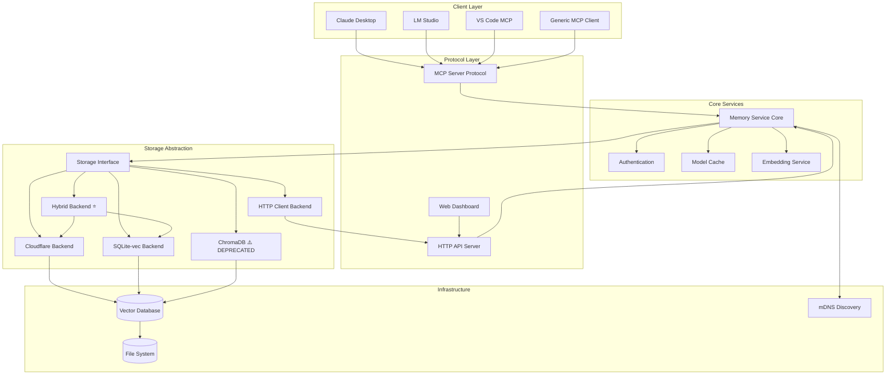

# MCP Memory Service 架构

## 概览

MCP Memory Service 是一个 Model Context Protocol 服务器，为智能助手提供语义记忆与持久化存储能力。它支持语义检索、时间回溯、标签组织等功能，帮助多轮对话维持长期上下文。

## 系统架构



> 由于现有 mermaid 图引用了客户端/服务名称，暂保留英文以匹配实际实现名称。

## 核心组件

### 1. 服务器层（`src/mcp_memory_service/server.py`）

负责处理 MCP 协议通信：

- **协议处理**：完全遵循 MCP 规范。
- **请求路由**：根据工具/方法分发到对应处理器。
- **响应构造**：生成符合规范的响应体。
- **客户端识别**：适配 Claude Desktop、LM Studio 等不同客户端的特性。
- **日志系统**：支持 JSON 结构化日志，兼容 Claude Desktop 控制台要求。

关键职责：

- 异步请求处理与错误边界管理。
- 全局模型与嵌入缓存管理。
- 存储后端的惰性初始化。
- 工具注册与调用生命周期管理。

### 2. 存储抽象层（`src/mcp_memory_service/storage/`）

统一接口，方便扩展不同后端：

#### 基类接口（`storage/base.py`）
```python
class MemoryStorage(ABC):
    async def initialize(self) -> None:
        """初始化存储后端"""

    async def store(self, memory: Memory) -> Tuple[bool, str]:
        """写入一条记忆"""

    async def retrieve(self, query: str, n_results: int) -> List[MemoryQueryResult]:
        """按语义相似度检索记忆"""

    async def search_by_tag(self, tags: List[str]) -> List[Memory]:
        """按标签检索记忆"""

    async def delete(self, content_hash: str) -> Tuple[bool, str]:
        """通过内容哈希删除"""

    async def recall_memory(self, query: str, n_results: int) -> List[Memory]:
        """基于自然语言时间表达的回忆"""
```

#### Hybrid Backend（`storage/hybrid.py`）⭐ **推荐**
- 生产默认方案：本地性能 + 云同步。
- 主存储：SQLite-vec，局部读取 ~5ms。
- 云存储：Cloudflare，保障多设备持久化。
- 异步队列后台同步，用户无感。
- 离线降级：无网络也能用，恢复后自动补同步。
- 容量告警：跟踪 Cloudflare 限额。
- 适用场景：生产部署、多设备用户。

#### Cloudflare Backend（`storage/cloudflare.py`）
- 使用 Cloudflare D1 + Vectorize 的云原生方案。
- 全球边缘网络，低延迟访问。
- Serverless，无需自管基础设施。
- 自动扩缩，具备高可用。
- 限额：D1 10GB，Vectorize 500 万向量。
- 适合纯云部署、无本地磁盘环境。

#### SQLite-vec Backend（`storage/sqlite_vec.py`）
- 轻量本地存储，读取 5ms。
- 依赖 SQLite + vec0 扩展，无需 PyTorch。
- 内存/依赖占用小。
- 适用于开发、单设备或 Hybrid 的本地层。

#### HTTP Client Backend（`storage/http_client.py`）
- 通过 HTTP API 使用远程存储。
- 适合集中式部署，客户端共享记忆池。
- Bearer Token / API Key 双认证。
- 带重试与指数退避。
- 场景：多客户端共用、远程 MCP 服务。

#### ChromaDB Backend（`storage/chroma.py`）⚠️ **已弃用**
- 自 v5.x 起弃用，计划 v6.0.0 移除。
- 建议迁移到 Hybrid。
- 依赖大、性能慢（15ms vs 5ms）。
- 仅供历史兼容，不建议新项目使用。

### 3. 模型层（`src/mcp_memory_service/models/`）

负责数据结构与校验：
```python
@dataclass
class Memory:
    id: str
    content: str
    content_hash: str
    memory_type: str
    tags: List[str]
    metadata: MemoryMetadata
    created_at: datetime
    updated_at: datetime
```

### 4. Web 界面（`src/mcp_memory_service/web/`）

- **前端**：响应式 React。
- **API**：RESTful 内存操作接口。
- **WebSocket**：实时更新。
- **认证**：API Key。
- **健康监控**：展示系统状态。

### 5. 配置管理（`src/mcp_memory_service/config.py`）

- 存储后端选择。
- 模型选择与缓存。
- 平台优化（CUDA/MPS/DirectML/ROCm）。
- 网络（HTTP/HTTPS/mDNS）。

## 关键设计模式

### Async/Await
```python
async def store_memory(self, content: str) -> Memory:
    embedding = await self._generate_embedding(content)
    memory = await self.storage.store(content, embedding)
    return memory
```

### 惰性初始化
```python
async def _ensure_storage_initialized(self):
    if self.storage is None:
        self.storage = await create_storage_backend()
    return self.storage
```

### 全局缓存策略
```python
_MODEL_CACHE = {}
_EMBEDDING_CACHE = LRUCache(maxsize=1000)
```

### 平台检测与优化
- macOS：MPS 加速。
- Windows：CUDA / DirectML。
- Linux：CUDA / ROCm / CPU。
- 兜底：ONNX Runtime。

## MCP 协议操作

### 核心记忆操作

| 操作 | 说明 | 参数 |
| --- | --- | --- |
| `store_memory` | 写入记忆 | content, tags, metadata |
| `retrieve_memory` | 语义检索 | query, n_results |
| `recall_memory` | 时间回忆 | time_expression, n_results |
| `search_by_tag` | 标签检索 | tags[] |
| `delete_memory` | 删除（哈希） | content_hash |
| `delete_by_tags` | 批量删除 | tags[] |

### 工具类操作

| 操作 | 说明 |
| --- | --- |
| `check_database_health` | 存储健康检查 |
| `optimize_db` | 数据库优化 |
| `export_memories` | 导出 JSON |
| `import_memories` | 导入 JSON |
| `get_memory_stats` | 使用统计 |

### 调试操作

| 操作 | 说明 |
| --- | --- |
| `debug_retrieve` | 查看相似度明细 |
| `exact_match_retrieve` | 精确匹配检索 |

## 数据流

### 写入流程
```
1. 客户端调用 store_memory
2. 服务器校验并填充 metadata
3. 内容哈希去重
4. 调用句向量模型生成 embedding
5. 写入向量数据库
6. 返回确认
```

### 检索流程
```
1. 客户端调用 retrieve_memory
2. 查询文本转向量
3. 执行向量相似度搜索
4. 结果按得分排序
5. 携带 metadata 返回
```

### 时间回忆
```
1. 客户端传入自然语言时间表达
2. 解析时间边界
3. 语义查询叠加时间过滤
4. 结果按时间排序返回
```

## 性能优化

- **模型缓存**：句向量模型全局缓存，首次使用 lazy load。
- **嵌入缓存**：常用 embedding 使用 LRU 缓存，可配置大小。
- **查询优化**：批处理 + 连接池 + 全异步 I/O。
- **平台优化**：自动检测硬件加速，选择最佳后端。

## 安全注意事项

- **认证**：HTTP 端点支持 API Key、Bearer Token，多客户端隔离认证。
- **数据隐私**：内容哈希去重，可选静态加密，多租户隔离。
- **网络安全**：HTTPS、CORS、端点限流。

## 部署架构

### 生产（Hybrid）⭐ 推荐
- 本地 SQLite-vec 性能 + Cloudflare 云备份。
- 后台异步同步。
- 离线可用，多设备共享。
- `install.py --storage-backend hybrid` 或 `MCP_MEMORY_STORAGE_BACKEND=hybrid`。

### 云端（Cloudflare）
- 无本地存储，纯云架构。
- 全局边缘节点。
- 自动扩缩，适合 CI/CD。
- 注意 D1 / Vectorize 限额。

### 开发（SQLite-vec）
- 轻量依赖，启动快。
- 适合本地开发与测试。
- `install.py --storage-backend sqlite_vec`。

### 多客户端共享（HTTP Server）
- 中心化 HTTP 服务，多个客户端共享记忆。
- 需启用 HTTP 模式并配置 API Key。

### 传统（ChromaDB）⚠️ 不推荐
- 已弃用，需迁移。
- 依赖大、性能慢，仅兼容旧部署。

## 扩展点

### 自定义存储
```python
class CustomStorage(MemoryStorage):
    async def store(self, memory: Memory) -> Tuple[bool, str]:
        ...
```

### 自定义嵌入模型
```python
EMBEDDING_MODEL = "your-model/name"
```

### 协议扩展
```python
types.Tool(
    name="custom_operation",
    description="自定义记忆操作",
    inputSchema={
        "type": "object",
        "properties": {
            "param1": {"type": "string"},
            "param2": {"type": "integer", "default": 0}
        },
        "required": ["param1"],
        "additionalProperties": false
    }
)
```

## 未来规划

- **WFGY 语义防火墙**：16 种失败模式检测与恢复。
- **本体层（Phase 0）**：构建受控词汇 / 分类体系 / 知识图谱。
- 自动记忆合并、语义聚类、重要度评分。
- 会话线程化、Agentic RAG、图谱关系、记忆压缩、联邦学习、实时协作、可视化工具等。

## 参考资料

- [MCP Protocol Specification](https://modelcontextprotocol.io/docs)
- [ChromaDB Documentation](https://docs.trychroma.com/)
- [SQLite Vec Extension](https://github.com/asg017/sqlite-vec)
- [Sentence Transformers](https://www.sbert.net/)
