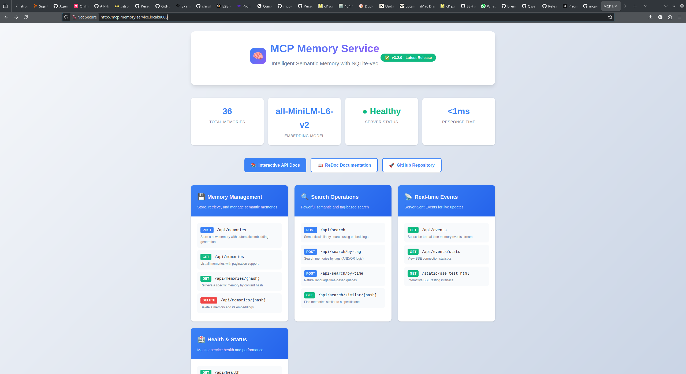

# MCP Memory Service 截图资源说明

本目录用于存放 Dashboard 等可视化素材，供文档引用。

## Dashboard 截图（v3.3.0）

**主要元素**：
- 渐变背景 + 卡片式布局；
- 实时统计（记忆总量、嵌入模型、健康状态、响应时间）；
- API 端点卡片 + Hover 效果；
- 技术栈徽章（FastAPI / SQLite-vec / PyTorch 等）；
- 响应式布局，桌面与移动端适配；
- 默认 30s 自动刷新。

## 访问地址
- Dashboard: http://localhost:8001
- mDNS: http://mcp-memory-service.local:8001
- API Docs: http://localhost:8001/api/docs
- ReDoc: http://localhost:8001/api/redoc

## 截图规范
1. 启动 HTTP Server：`python scripts/run_http_server.py`
2. 等待统计数据加载；
3. 以 1920x1080 全屏截图；
4. 按 `dashboard-v{version}.png` 命名保存至本目录；
5. 更新 README 引用。

## 命名约定
- `dashboard-v{version}.png`：主界面；
- `api-docs-v{version}.png`：API 文档页；
- `mobile-v{version}.png`：移动端布局；
- `feature-{name}-v{version}.png`：特性/模块截图。
